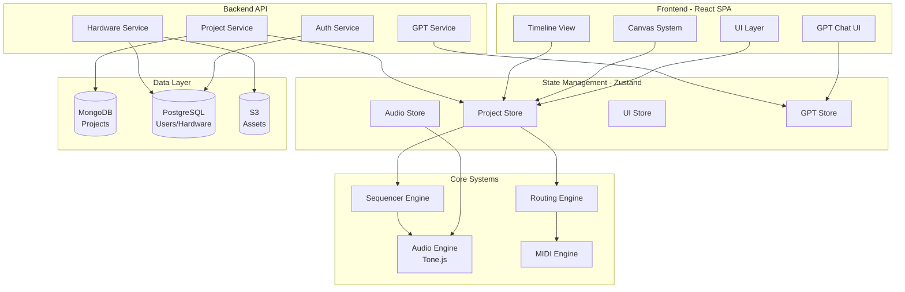
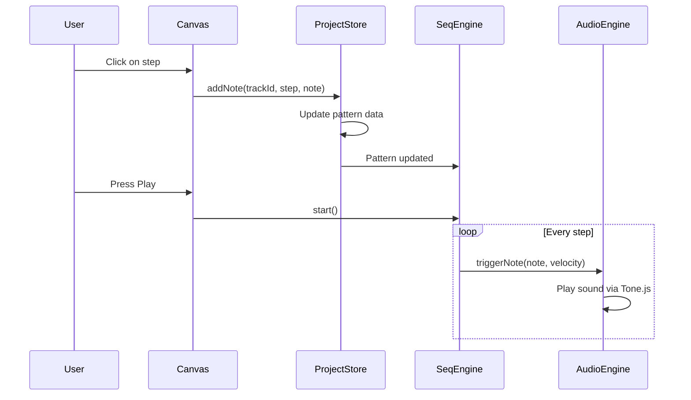
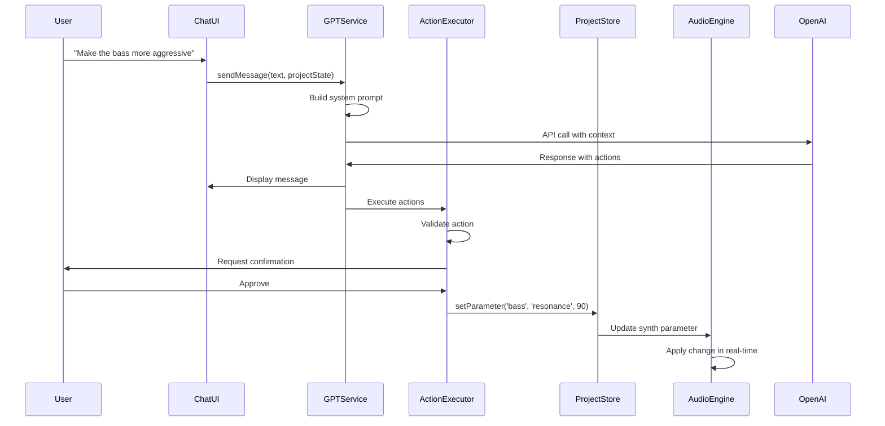
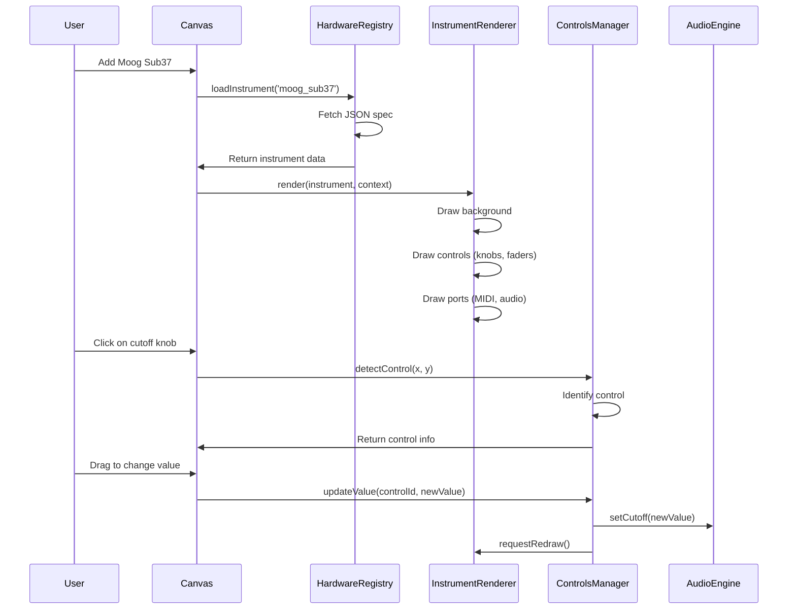

# 🏛️ DawlessStudio - Detailed Architecture

## System Architecture Diagram



## Data Flow Diagrams

### 1. User Creates a Note



### 2. DawlessGPT Modifies Project



### 3. Hardware Clone Rendering



## Core Systems Deep Dive

### Audio Engine Architecture

```typescript
// Core audio context (singleton)
class AudioEngineCore {
  private context: AudioContext;
  private masterChain: Tone.Channel;
  private instruments: Map<string, Instrument>;
  
  constructor() {
    // Initialize Tone.js once
    this.context = Tone.getContext().rawContext as AudioContext;
    this.masterChain = new Tone.Channel().toDestination();
  }
  
  addInstrument(id: string, type: string): Instrument {
    const instrument = InstrumentFactory.create(type);
    instrument.connect(this.masterChain);
    this.instruments.set(id, instrument);
    return instrument;
  }
  
  removeInstrument(id: string) {
    const instrument = this.instruments.get(id);
    if (instrument) {
      instrument.disconnect();
      instrument.dispose();
      this.instruments.delete(id);
    }
  }
}

// Instrument abstraction
abstract class Instrument {
  protected nodes: Tone.ToneAudioNode[];
  protected parameters: Map<string, Parameter>;
  
  abstract connect(destination: Tone.ToneAudioNode): void;
  abstract disconnect(): void;
  abstract dispose(): void;
  abstract trigger(note: string, velocity: number, time?: number): void;
  
  setParameter(name: string, value: number) {
    const param = this.parameters.get(name);
    if (param) {
      param.value = value;
      this.applyParameter(name, value);
    }
  }
  
  protected abstract applyParameter(name: string, value: number): void;
}

// Example: Generic Bass Synth
class GenericBassSynth extends Instrument {
  private synth: Tone.MonoSynth;
  private filter: Tone.Filter;
  private distortion: Tone.Distortion;
  
  constructor() {
    super();
    
    // Create audio chain
    this.synth = new Tone.MonoSynth({
      oscillator: { type: 'sawtooth' },
      envelope: { attack: 0.001, decay: 0.1, sustain: 0, release: 0.1 }
    });
    
    this.filter = new Tone.Filter({ type: 'lowpass', frequency: 1000, Q: 10 });
    this.distortion = new Tone.Distortion(0.2);
    
    // Connect chain
    this.synth.connect(this.filter);
    this.filter.connect(this.distortion);
    
    // Register parameters
    this.parameters.set('cutoff', { value: 1000, min: 20, max: 20000 });
    this.parameters.set('resonance', { value: 10, min: 0, max: 30 });
    this.parameters.set('drive', { value: 0.2, min: 0, max: 1 });
  }
  
  connect(destination: Tone.ToneAudioNode) {
    this.distortion.connect(destination);
  }
  
  trigger(note: string, velocity: number, time?: number) {
    const normalizedVelocity = velocity / 127;
    this.synth.triggerAttackRelease(note, '8n', time, normalizedVelocity);
  }
  
  protected applyParameter(name: string, value: number) {
    switch (name) {
      case 'cutoff':
        this.filter.frequency.value = value;
        break;
      case 'resonance':
        this.filter.Q.value = value;
        break;
      case 'drive':
        this.distortion.distortion = value;
        break;
    }
  }
  
  disconnect() {
    this.distortion.disconnect();
  }
  
  dispose() {
    this.synth.dispose();
    this.filter.dispose();
    this.distortion.dispose();
  }
}
```

### Sequencer Engine Architecture

```typescript
// Sequencer core
class SequencerEngine {
  private patterns: Map<string, Pattern>;
  private transport: Tone.Transport;
  private activePattern: string | null = null;
  private events: Map<string, number[]> = new Map(); // event IDs
  
  constructor(private audioEngine: AudioEngineCore) {
    this.transport = Tone.getTransport();
    this.transport.PPQ = 96; // Pulses per quarter note
  }
  
  loadPattern(patternId: string, trackId: string) {
    const pattern = this.patterns.get(patternId);
    if (!pattern) return;
    
    // Clear previous events for this track
    this.clearTrackEvents(trackId);
    
    // Schedule all steps
    const eventIds: number[] = [];
    pattern.steps.forEach((step, index) => {
      if (!step.enabled) return;
      
      const time = this.calculateStepTime(index, pattern.length);
      
      const eventId = this.transport.schedule((scheduledTime) => {
        // Apply P-Locks if any
        this.applyPLocks(trackId, step.pLocks);
        
        // Trigger note
        this.audioEngine.trigger(
          trackId,
          step.note,
          step.velocity,
          scheduledTime
        );
      }, time);
      
      eventIds.push(eventId);
    });
    
    this.events.set(trackId, eventIds);
  }
  
  private calculateStepTime(step: number, totalSteps: number): string {
    // Convert step to musical time (e.g., "0:0:0" for first step)
    const sixteenthsPerStep = 16 / totalSteps;
    const sixteenths = step * sixteenthsPerStep;
    return `0:0:${sixteenths}`;
  }
  
  private applyPLocks(trackId: string, pLocks: PLock[]) {
    pLocks.forEach(pLock => {
      this.audioEngine.setParameter(trackId, pLock.parameter, pLock.value);
    });
  }
  
  start() {
    this.transport.start();
  }
  
  stop() {
    this.transport.stop();
  }
  
  pause() {
    this.transport.pause();
  }
  
  setTempo(bpm: number) {
    this.transport.bpm.value = bpm;
  }
}

// Pattern data structure
interface Pattern {
  id: string;
  name: string;
  length: number; // 16, 32, 64, etc.
  steps: Step[];
  automations: Automation[];
}

interface Step {
  index: number;
  enabled: boolean;
  note: string; // MIDI note (e.g., "C4")
  velocity: number; // 0-127
  probability: number; // 0-100 (%)
  pLocks: PLock[]; // Parameter locks for this step
}

interface PLock {
  parameter: string; // e.g., "cutoff"
  value: number;
}

interface Automation {
  type: 'lfo' | 'curve' | 'envelope';
  target: string; // Parameter name
  data: LFOData | CurveData | EnvelopeData;
}
```

### Canvas Rendering System

```typescript
// Canvas engine with layers
class CanvasEngine {
  private canvas: HTMLCanvasElement;
  private ctx: CanvasRenderingContext2D;
  private layers: Map<string, CanvasLayer> = new Map();
  private camera: Camera;
  private dirtyRects: DirtyRectTracker;
  
  constructor(canvasElement: HTMLCanvasElement) {
    this.canvas = canvasElement;
    this.ctx = canvasElement.getContext('2d')!;
    this.camera = new Camera();
    this.dirtyRects = new DirtyRectTracker();
    
    // Create layers
    this.layers.set('background', new BackgroundLayer());
    this.layers.set('instruments', new InstrumentsLayer());
    this.layers.set('cables', new CablesLayer());
    this.layers.set('ui', new UILayer());
    
    // Start render loop
    this.startRenderLoop();
  }
  
  private startRenderLoop() {
    const render = () => {
      // Only render if something changed
      if (this.dirtyRects.hasDirty()) {
        this.renderFrame();
        this.dirtyRects.clear();
      }
      requestAnimationFrame(render);
    };
    render();
  }
  
  private renderFrame() {
    // Apply camera transform
    this.ctx.save();
    this.camera.applyTransform(this.ctx);
    
    // Render each layer (painter's algorithm)
    const layerOrder = ['background', 'cables', 'instruments', 'ui'];
    layerOrder.forEach(layerName => {
      const layer = this.layers.get(layerName);
      if (layer && layer.visible) {
        layer.render(this.ctx, this.camera);
      }
    });
    
    this.ctx.restore();
  }
  
  markDirty(rect: Rect) {
    this.dirtyRects.add(rect);
  }
}

// Camera for zoom/pan
class Camera {
  x = 0;
  y = 0;
  zoom = 1;
  
  applyTransform(ctx: CanvasRenderingContext2D) {
    ctx.translate(-this.x, -this.y);
    ctx.scale(this.zoom, this.zoom);
  }
  
  screenToWorld(screenX: number, screenY: number): Point {
    return {
      x: (screenX + this.x) / this.zoom,
      y: (screenY + this.y) / this.zoom
    };
  }
  
  worldToScreen(worldX: number, worldY: number): Point {
    return {
      x: worldX * this.zoom - this.x,
      y: worldY * this.zoom - this.y
    };
  }
}

// Instrument rendering
class InstrumentRenderer {
  render(ctx: CanvasRenderingContext2D, instrument: Instrument) {
    // Draw background panel
    this.drawBackground(ctx, instrument);
    
    // Draw all controls
    instrument.controls.forEach(control => {
      switch (control.type) {
        case 'knob':
          this.drawKnob(ctx, control);
          break;
        case 'fader':
          this.drawFader(ctx, control);
          break;
        case 'button':
          this.drawButton(ctx, control);
          break;
      }
    });
    
    // Draw ports
    this.drawPorts(ctx, instrument);
    
    // Draw labels
    this.drawLabels(ctx, instrument);
  }
  
  private drawKnob(ctx: CanvasRenderingContext2D, control: KnobControl) {
    const { x, y, radius, value, min, max } = control;
    
    // Knob body
    ctx.fillStyle = '#2a2a2a';
    ctx.beginPath();
    ctx.arc(x, y, radius, 0, Math.PI * 2);
    ctx.fill();
    
    // Indicator line
    const angle = ((value - min) / (max - min)) * Math.PI * 1.5 - Math.PI * 0.75;
    const lineLength = radius * 0.7;
    ctx.strokeStyle = '#00ff00';
    ctx.lineWidth = 2;
    ctx.beginPath();
    ctx.moveTo(x, y);
    ctx.lineTo(
      x + Math.cos(angle) * lineLength,
      y + Math.sin(angle) * lineLength
    );
    ctx.stroke();
    
    // Value display
    ctx.fillStyle = '#ffffff';
    ctx.font = '10px monospace';
    ctx.textAlign = 'center';
    ctx.fillText(value.toString(), x, y + radius + 15);
  }
}
```

### Routing System

```typescript
// Cable routing engine
class RoutingEngine {
  private cables: Map<string, Cable> = new Map();
  private graph: Map<string, string[]> = new Map(); // adjacency list
  
  addCable(cable: Cable): Result<Cable, Error> {
    // Validate connection
    const validation = this.validateConnection(cable);
    if (!validation.ok) {
      return validation;
    }
    
    // Check for loops (audio only)
    if (cable.type === 'audio') {
      if (this.wouldCreateLoop(cable)) {
        return { ok: false, error: new Error('Would create audio feedback loop') };
      }
    }
    
    // Add to graph
    this.cables.set(cable.id, cable);
    this.updateGraph(cable, 'add');
    
    // Notify audio engine
    if (cable.type === 'audio') {
      this.audioEngine.connectAudio(cable.from.instrumentId, cable.to.instrumentId);
    } else if (cable.type === 'midi') {
      this.midiEngine.connectMIDI(
        cable.from.instrumentId,
        cable.to.instrumentId,
        cable.midiChannel
      );
    }
    
    return { ok: true, value: cable };
  }
  
  private validateConnection(cable: Cable): Result<void, Error> {
    // Check if instruments exist
    if (!this.instrumentExists(cable.from.instrumentId)) {
      return { ok: false, error: new Error('Source instrument not found') };
    }
    if (!this.instrumentExists(cable.to.instrumentId)) {
      return { ok: false, error: new Error('Destination instrument not found') };
    }
    
    // Check if ports exist and are compatible
    const fromPort = this.getPort(cable.from);
    const toPort = this.getPort(cable.to);
    
    if (!fromPort || !toPort) {
      return { ok: false, error: new Error('Port not found') };
    }
    
    if (fromPort.type !== toPort.type) {
      return { ok: false, error: new Error('Port types incompatible') };
    }
    
    return { ok: true, value: undefined };
  }
  
  private wouldCreateLoop(cable: Cable): boolean {
    // BFS to detect cycle
    const visited = new Set<string>();
    const queue: string[] = [cable.to.instrumentId];
    
    while (queue.length > 0) {
      const current = queue.shift()!;
      
      if (current === cable.from.instrumentId) {
        return true; // Found a loop
      }
      
      if (visited.has(current)) continue;
      visited.add(current);
      
      const neighbors = this.graph.get(current) || [];
      queue.push(...neighbors);
    }
    
    return false;
  }
  
  // Suggest optimal routing
  suggestRouting(): CableSuggestion[] {
    const suggestions: CableSuggestion[] = [];
    
    // Check for unconnected MIDI INs
    this.instruments.forEach(instrument => {
      const midiIn = instrument.ports.find(p => p.type === 'midi' && p.direction === 'in');
      if (midiIn && !this.isPortConnected(instrument.id, midiIn.id)) {
        suggestions.push({
          type: 'warning',
          message: `${instrument.name} MIDI IN not connected`,
          suggestion: `Connect sequencer to ${instrument.name}`
        });
      }
    });
    
    // Check for unconnected audio outs
    // Check for missing mixer inputs
    // etc.
    
    return suggestions;
  }
}
```

## State Management

### Zustand Store Slices

```typescript
// Project store
interface ProjectState {
  id: string;
  name: string;
  tempo: number;
  timeSignature: string;
  key: string;
  instruments: Instrument[];
  patterns: Pattern[];
  timeline: TimelineData;
  routing: Cable[];
  
  // Actions
  setTempo: (tempo: number) => void;
  addInstrument: (type: string) => void;
  removeInstrument: (id: string) => void;
  updateInstrument: (id: string, updates: Partial<Instrument>) => void;
  // ... more actions
}

// Audio store (separate for performance)
interface AudioState {
  isPlaying: boolean;
  currentPosition: number;
  meterLevels: Map<string, MeterData>;
  
  // Actions
  play: () => void;
  stop: () => void;
  pause: () => void;
  // ... more actions
}

// GPT store
interface GPTState {
  messages: GPTMessage[];
  isTyping: boolean;
  mode: GPTMode;
  
  // Actions
  sendMessage: (text: string) => Promise<void>;
  setMode: (mode: GPTMode) => void;
  executeAction: (action: GPTAction) => Promise<void>;
  // ... more actions
}
```

## Performance Optimizations

### 1. Canvas Rendering

- **Dirty rectangles**: Only redraw changed areas
- **Layer separation**: Static elements cached
- **OffscreenCanvas**: Rendering in worker thread
- **Object pooling**: Reuse drawing objects

### 2. Audio Processing

- **Single AudioContext**: No multiple contexts
- **Node reuse**: Don’t recreate nodes unnecessarily
- **Offline rendering**: Bounce-to-disk in background
- **Web Workers**: DSP calculations offloaded

### 3. State Management

- **Zustand slices**: Prevent unnecessary re-renders
- **Memoization**: React.memo, useMemo, useCallback
- **Virtualization**: Timeline only renders visible items
- **Debouncing**: Parameter changes batched

### 4. Data Loading

- **Lazy loading**: Load instruments on-demand
- **Code splitting**: Dynamic imports for modules
- **Asset optimization**: Compressed images, lazy PDFs
- **Service workers**: Cache static assets

-----

**Version:** 1.0.0  
**Last Updated:** 2025-10-31